# L1 - Complexité

## Description
Pour ce premier labo en ASD, nous avons réalisé plusieurs programmes en C++ qui nous permettens d'analyser la complexité 
des différents algorithmes de tri vu en PRG1 et de deux algorithmes de tri supplémentaires. 
Pour rappel, les algorithmes de tri vu en PRG1 sont:
- Tri par insertion
- Tri par sélection
- Tri à bulle

Nous avons donc également ajouté deux algorithmes de tri supplémentaires:
- sort
- stable_sort

Ces deux derniers algorithmes sont des algorithmes de tri de la STL de C++. 

## Objectifs
Le objectifs de ce labo sont:
- Se rappeler les 3 algorithmes de tri simples vus en PRG1
  - Tri par insertion
  - Tri par sélection
  - Tri à bulle
- Découvrir deux nouveaux algorithmes de tri de la STL de C++:
  - sort
  - stable_sort
- Nous faire estimer des complexités en mesurant empiriquement 
  - Le temps de comparaison 
  - Le temps d'affectation 
  - Le temps de calcul
- Nous faire constater que l'ordre des entrées peut avoir une influence sur la complexité de certains algorithmes de tri, 
et qu'il faut donc considérer le meilleur cas, le pire et le cas moyen.

## Réalisation
Pour réaliser ce labo, nous avons d'abord crée le premier programme [mainTestCustomSorts.cpp](../src/mainTestCustomSorts.cpp) qui nous permettait de 
tester les 3 algorithmes de tri vus en PRG1 et les deux supplémentaires. Ces derniers sont implémentés 
dans le fichier [customSorts.h](../src/customSorts.h).

Ensuite, nous avons crée une fonction générique de Vector<T> générant des vecteurs de taille n avec des valeurs 
aléatoires et triés dans l'ordre croissant, décroissant ou aléatoire. Cette fonction est implémentée dans le fichier
[generateVector.h](../src/generateVector.h) qui est donc inclus dans le deuxième programme [mainTimeMeasurement.cpp](../src/mainTimeMeasurement.cpp). 
Ce deuxième programme nous permet de mesurer le temps de comparaison, d'affectation et de calcul pour les 5 algorithmes.

Pour finir, nous avons créer une classe [OpCounter.h](../src/OpCounter.h) qui qui stocke une valeur numérique par objet,
et maintient des variables statiques de classe comptant les opérations. Cette classe est utilisée pour le troisième 
programme [mainCountComparaisonAndAffectation.cpp](../src/mainCountComparisonAndAffectation.cpp) qui nous permet de compter le nombres d'opérations pour les 5 algorithmes.

Le deuxième et troisième programme exportent leurs resulats dans des fichiers csv qui sont ensuite utilisés pour générer
des graphiques en svg.

## Résultats

### Mesure du temps

#### Entrée triée dans l'ordre croissant

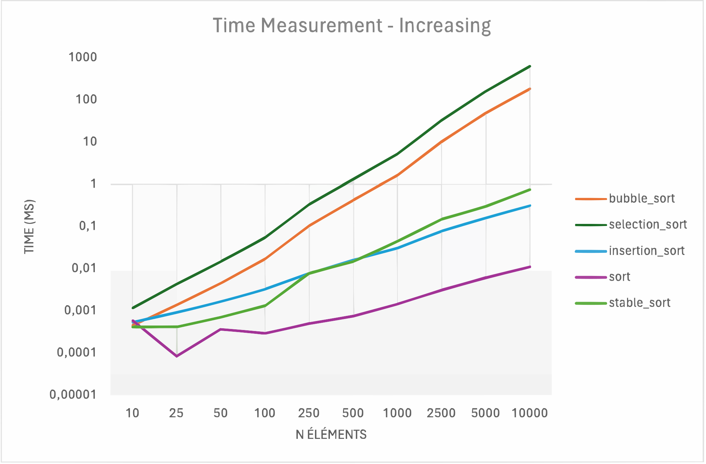

Fichier csv : [time_measurement_increasing.csv](csv/time_measurement_increasing.csv)

#### Entrée triée dans l'ordre décroissant

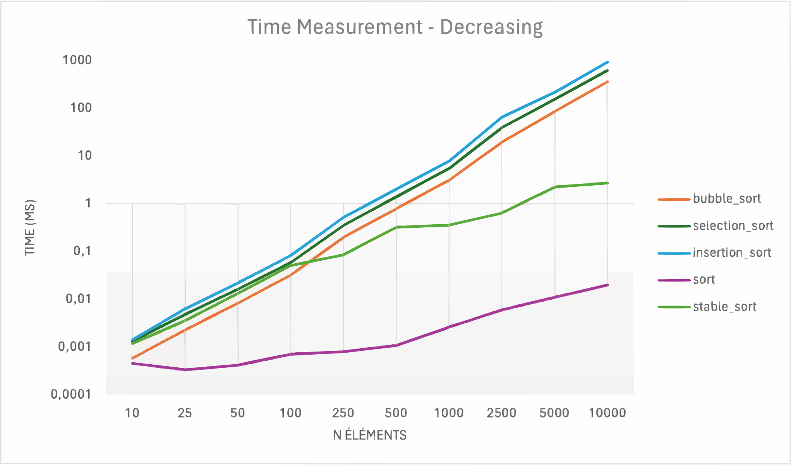

Fichier csv : [time_measurement_decreasing.csv](csv/time_measurement_decreasing.csv)

#### Entrée aléatoire

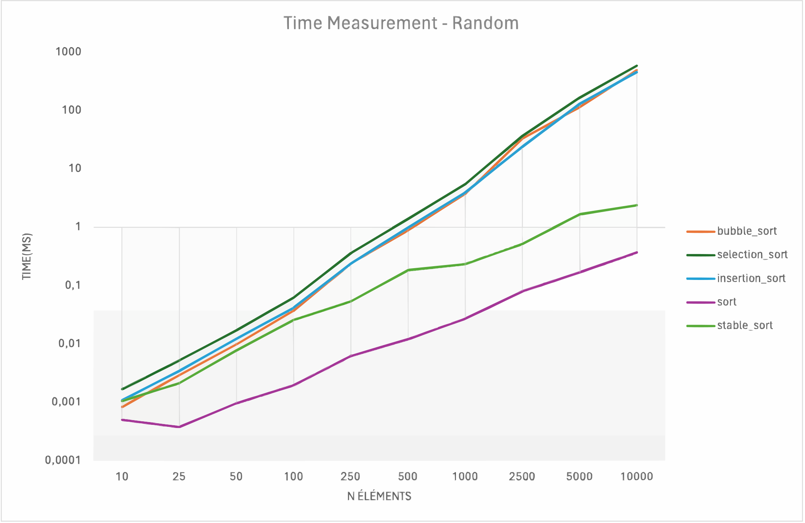

Fichier csv : [time_measurement_random.csv](csv/time_measurement_random.csv)

#### Entrée presque presque triée dans l'ordre croissant

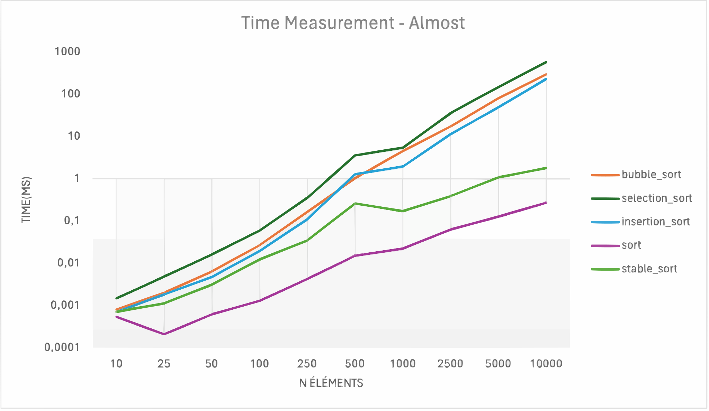

Fichier csv : [time_measurement_almost.csv](csv/time_measurement_almost.csv)

### Observations

En règle général, les algorithme de trie à bulle et de sélection sont les plus lent, tandis que le tri par insertion est un peu plus rapide. Les deux algorithmes de la STL de C++ sont les plus rapides.

A noter que les valeurs peuvent varier en fonction de la machine sur laquelle les tests sont effectués.

### Nombres d'assignations et de comparaisons

#### Entrée triée dans l'ordre croissant

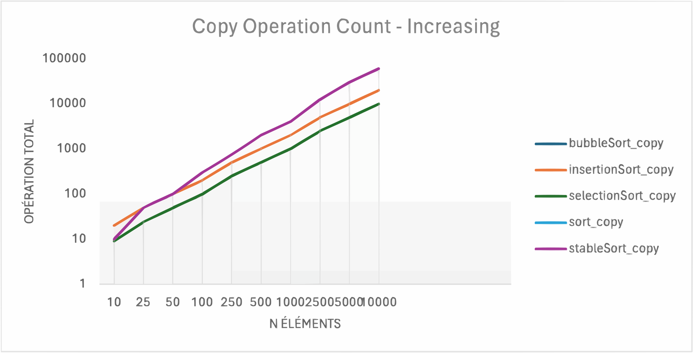
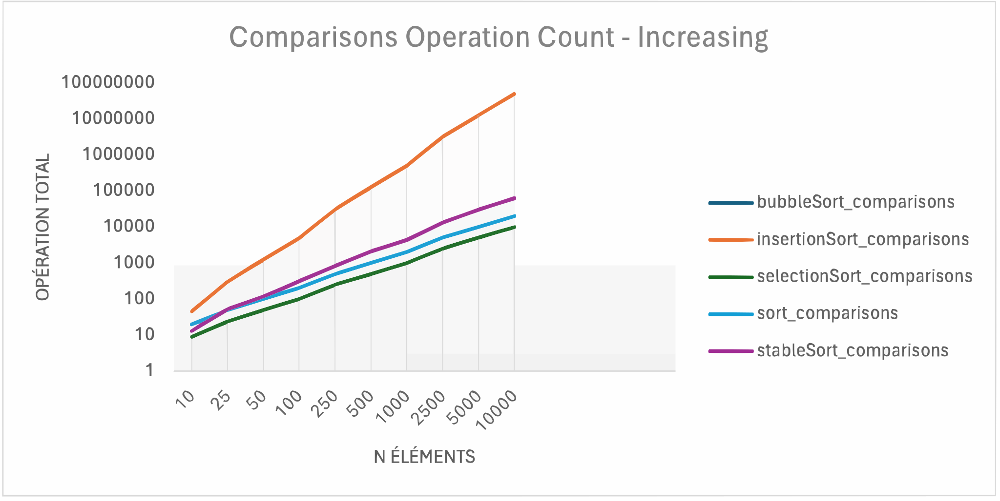

Fichier csv : [operation_count_increasing.csv](csv/operation_count_increasing.csv)

#### Entrée triée dans l'ordre décroissant

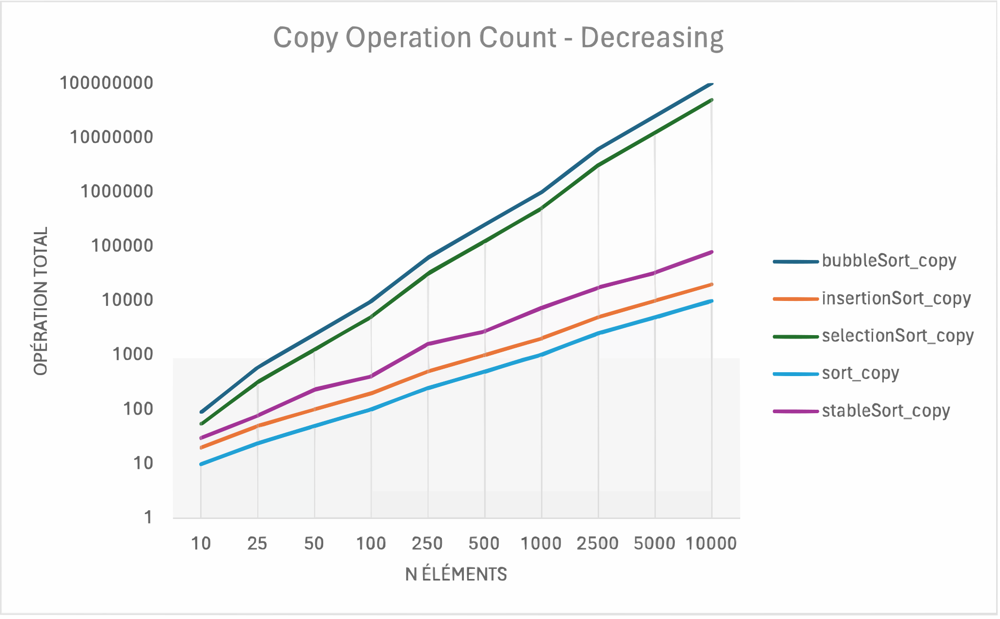
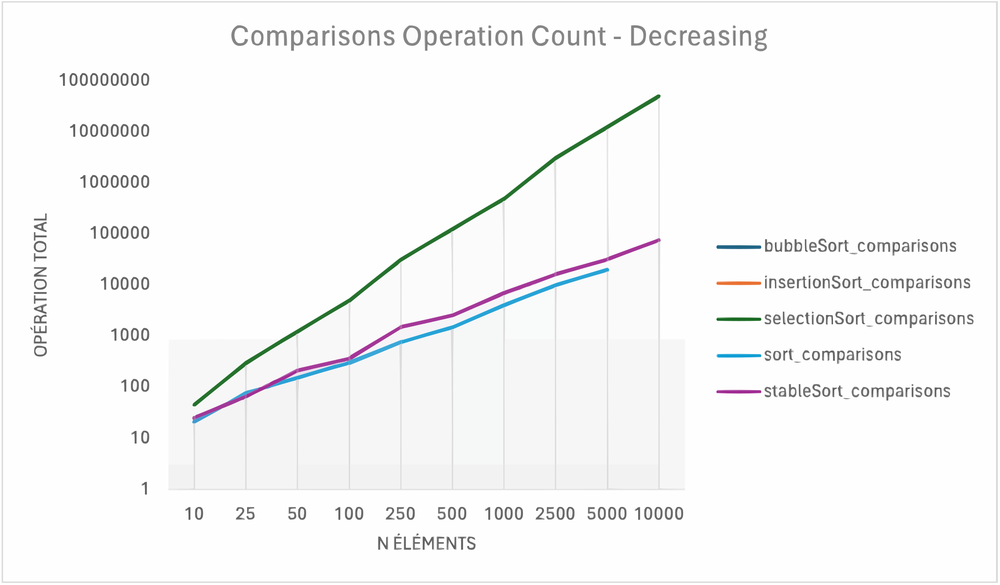

Fichier csv : [operation_count_decreasing.csv](csv/operation_count_decreasing.csv)

#### Entrée aléatoire

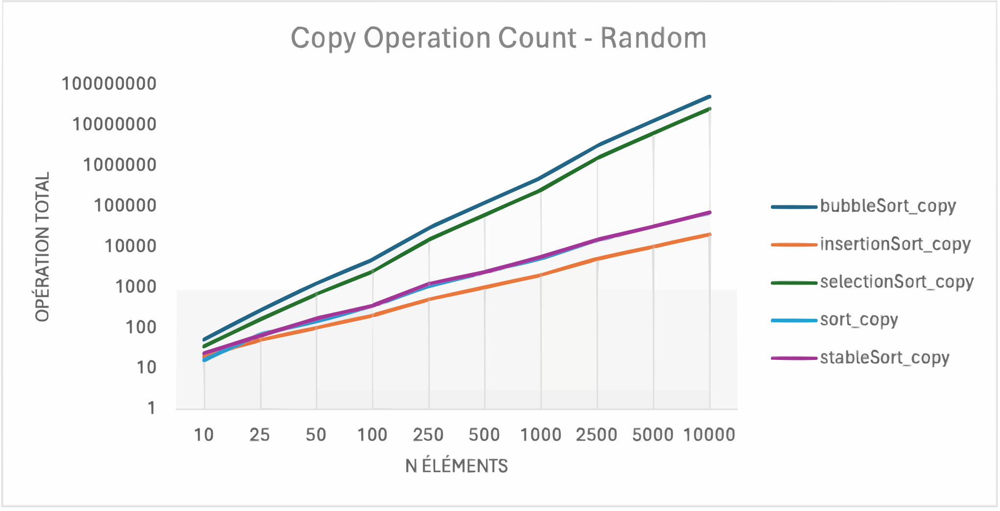
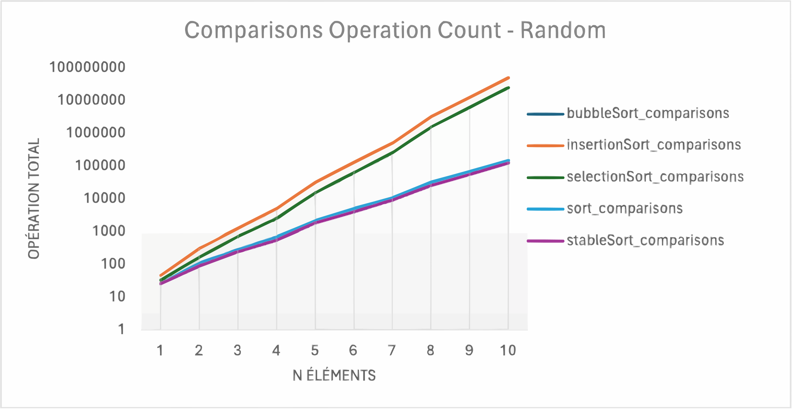

Fichier csv : [operation_count_random.csv](csv/operation_count_random.csv)

#### Entrée presque triée dans l'ordre croissant

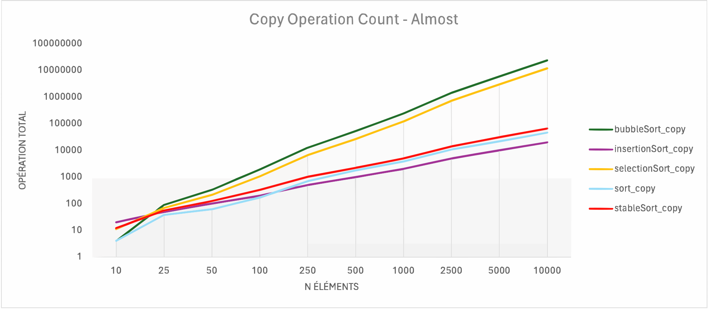
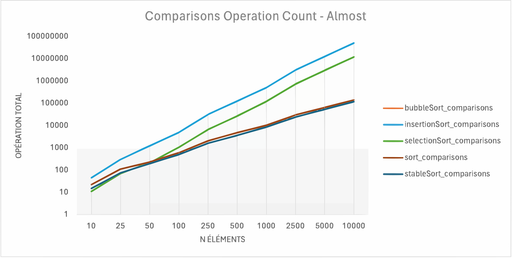

Fichier csv : [operation_count_almost.csv](csv/operation_count_almost.csv)

### Observations

#### Comparaisons
Le tri à bulles semble être le moins efficace en termes de nombre de comparaisons pour des données en ordre décroissant, tandis que les deux algorithmes STL C++ sont les plus efficaces globalement. Les performances du tri par sélection restent assez constantes par rapport aux autres, et le tri par insertion varie mais reste souvent mieux que le tri à bulles et moins performant que le tri rapide et stable.

#### Assignations
On observe que le tri par insertion a tendance à avoir le moins d'opérations d'assignation dans les cas presque triés et en ordre croissant (surtout sur des données presques triées). Le tri à bulles et le tri par sélection montrent un nombre plus élevé d'assignations sur tous les graphiques, indiquant efficacité médiocre en termes d'utilisation de la mémoire. Les tries STL C++ affichent également un nombre d'assignations relativement bas, mais le tri stable semble légèrement plus performant, en particulier avec des données en ordre décroissant et aléatoires.

## Analyse
### Complexités des algorithmes de tri

#### Bubble Sort
Le tri à bulle est un algorithme de tri simple qui consiste à faire remonter les plus grands éléments d'un tableau.

| Cas               | Complexité  |
|-------------------|-------------|
| Meilleur cas      | O(n)        |
| Cas moyen         | O(n^2)      |
| Pire cas          | O(n^2)      |

#### Insertion Sort
Le tri par insertion est un algorithme de tri simple qui consiste à insérer un élément à sa place dans un tableau trié.

| Cas               | Complexité  |
|-------------------|-------------|
| Meilleur cas      | O(n)        |
| Cas moyen         | O(n^2)      |
| Pire cas          | O(n^2)      |

#### Selection Sort
Le tri par sélection est un algorithme de tri simple qui consiste à sélectionner le plus petit élément d'un tableau.

| Cas               | Complexité  |
|-------------------|-------------|
| Meilleur cas      | O(n^2)      |
| Cas moyen         | O(n^2)      |
| Pire cas          | O(n^2)      |

#### Sort
La fonction sort de la STL de C++ est un algorithme de tri qui utilise le tri rapide.

| Cas               | Complexité  |
|-------------------|-------------|
| Meilleur cas      | O(n log n)  |
| Cas moyen         | O(n log n)  |
| Pire cas          | O(n log n)  |

*Source : https://cplusplus.com/reference/algorithm/sort/*

#### Stable Sort
La fonction stable_sort de la STL de C++ est un algorithme de tri qui utilise le tri fusion.

| Cas               | Complexité   |
|-------------------|--------------|
| Meilleur cas      | O(n log^2 n) |
| Cas moyen         | O(n log^2 n) |
| Pire cas          | O(n log^2 n) |

*Source : https://cplusplus.com/reference/algorithm/stable_sort/*

## Conclusion
Nous avons pu constater que les algorithmes de tri de la STL de C++ sont plus performants que les algorithmes de tri vus en PRG1 en termes de temps et d'opérations. Nous avons également pu constater que l'ordre des entrées peut avoir une influence sur la complexité de certains algorithmes de tri, et qu'il faut donc considérer le meilleur cas, le pire et le cas moyen.
